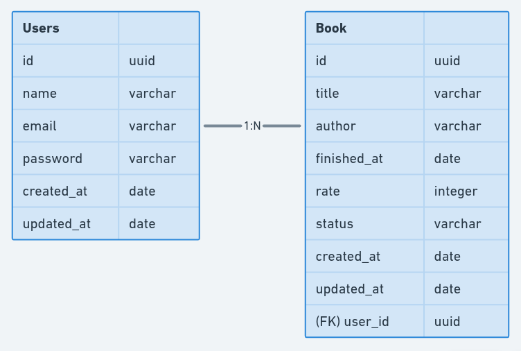

  

## Functional Requirements

### User
  - [ ] It must be able create a new user
  - [ ] It must be able to show user info

### Session
  - [ ] It must be able to authenticate an user

### Books
  - [ ] It must be able to create a new book
  - [ ] It must be able to update book info
  - [ ] It must be able to delete a book
  - [ ] It must be able to list all books
  - [ ] It must be able to update book status

---

## Business Logic

### User
  - [ ] It must not be able to create a user with an existing email
  - [ ] It must hash user password before save on database
  - [ ] It must be authenticated to show user info

### Book
  - [ ] It must be able to filter the books by status
  - [ ] It must be able to rate only read books
